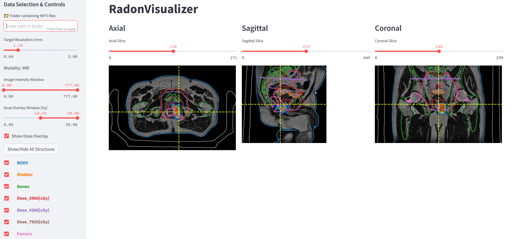

# RadonVisualizer

A simple, interactive Streamlit app for visualizing 3D medical images (CT/MRI) in NIfTI format.
[Largely AI-based coding]
---



## ✅ Supported Features

- **Dynamic Resolution**
  - Adjustable resolution (default 2mm; range: smallest spatial spacing up to 3mm).

- **Flexible Overlays**
  - Toggle dose map overlays on/off.
  - Toggle structure mask overlays individually or show/hide all with one button.

- **Multi-View Visualization**
  - Axial, sagittal, and coronal views displayed side-by-side.
  - Interactive slice navigation with cross-lines showing current slice positions.

---

## 🚀 How to Use

1. **Prepare Your Folder**

Put your NIfTI files into a single folder, following this naming convention:

```text
your_folder/
├── image.nii.gz       # Required: main CT or MRI image
├── dose.nii.gz        # Optional: dose map
├── structure1.nii.gz  # Optional: structure masks (any name)
├── structure2.nii.gz
└── ...
```

2. **Run the App**

From your terminal, run:

```bash
python -m streamlit run main.py
```
